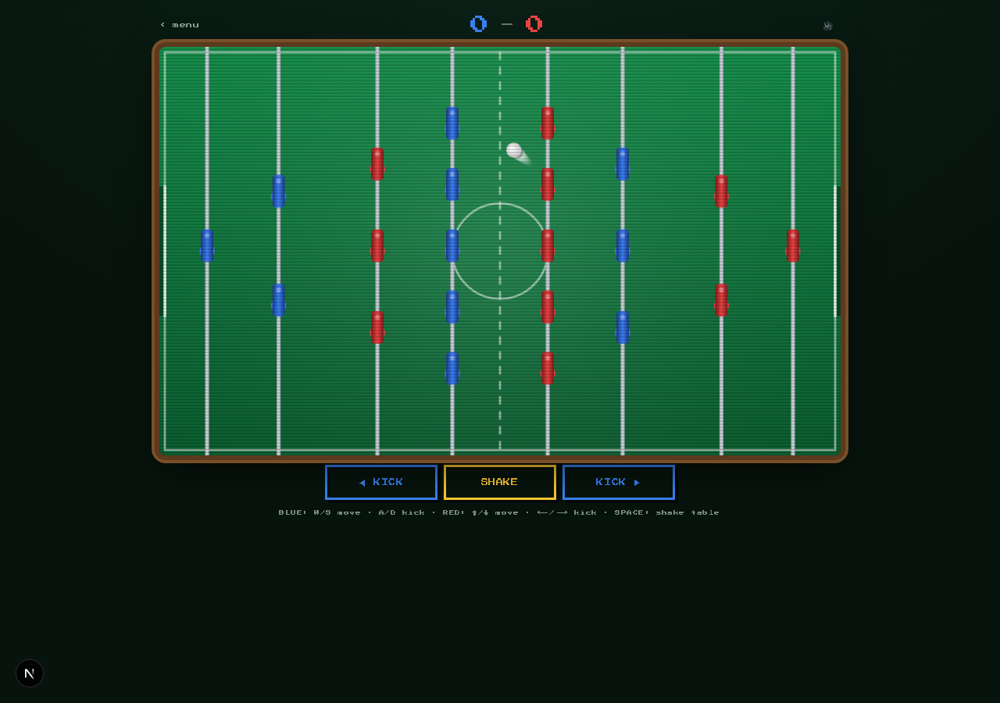

# fooseball

Old-school **real-time, 2-player foosball** in the browser. Create a room, share the code (or a one-tap invite link), and play a friend anywhere — first to 5 goals wins. Winners log their initials to a live leaderboard.

Day 29 of Savion's [100-Day AI Build Challenge](https://www.100dayaichallenge.com/share/savion).

## Screenshot



## Features

- **Real-time online play** over Supabase Realtime — no accounts, no setup. One player hosts, the other joins with a 4-letter code or an invite link.
- **Split-authority netcode**: each player owns their own rods (instant local control); the host simulates the ball authoritatively, so there's no desync or double-scoring. The guest interpolates for smoothness.
- **Real foosball controls** — slide your rods up/down, and *kick the ball left or right* by spinning the rod (you can see the men swing their legs).
- **Shake the table** (Space) to free a stuck ball, with a cooldown — just like bumping a real table.
- **Live leaderboard** — initials, wins/losses, goals-for. Updates in real time as matches finish.
- **Plays on touch** — drag to move your rods, on-screen buttons to kick and shake.
- **Old-school arcade feel** — green-felt table, CRT scanlines, chunky pixel scoreboard, synthesized sound effects (no audio files), screen shake and a GOAL flash on every goal.
- **Local practice mode** — two players, one keyboard.

## Controls

| | Move rods | Kick | Shake table |
|---|---|---|---|
| **Online** | ↑ / ↓ (or drag) | ← / → (or buttons) | Space (or button) |
| **Local 2P** | Blue: W/S · Red: ↑/↓ | Blue: A/D · Red: ←/→ | Space |

## Install

```bash
git clone https://github.com/Still-InFrame/day-29-fooseball.git
cd day-29-fooseball
npm install
npm run dev
```

Then open the local URL it prints. The app reads `NEXT_PUBLIC_SUPABASE_URL` and `NEXT_PUBLIC_SUPABASE_PUBLISHABLE_KEY` from `.env.local` for the realtime channel + leaderboard.

## Stack

Next.js (App Router) · TypeScript · Tailwind CSS · Canvas 2D · Supabase Realtime (broadcast + presence) + Postgres · deployed on Vercel.

---

Part of the [100-Day AI Build Challenge](https://www.100dayaichallenge.com/share/savion) — one new app a day for 100 days.
